# GrittyOS — Canonical ERD (Current State)

## Update Discipline (read this first)

This document is the canonical schema reference for `gritty-recruit-hub-rebuild`. Every migration that adds, drops, or modifies a table, column, constraint, RLS policy, or FK relationship updates this document **in the same commit as the migration file itself**. The single source of truth for schema lives here. Other documents (`EXECUTION_PLAN.md`, sprint specs, retros) reference this ERD by path; they do not duplicate its content.

This discipline exists to prevent the failure mode that motivated Sprint 013 D0: multiple migrations shipping over weeks without ERD updates, leaving the canonical reference stale enough that downstream sprints reconstruct schema from migration files individually rather than from a coherent document. The Sprint 012 data-architecture-confusion incident (Supabase vs. Google Sheets canonical question, 2026-03-19) is the kind of confusion stale ERDs cause; this discipline is the structural fix. See `docs/specs/.coach-scheduler-sprints/EXECUTION_PLAN.md` — Architectural Carry-Forward #8 ("ERD update discipline").

---

## 1. Architecture Overview

The schema operates as a **two-layer model** per `EXECUTION_PLAN.md` Decision K and the "Coach Identity Architecture (intake log + canonical)" section:

- **Intake-log layer** (Sprint 012 origin): `coach_submissions`, `visit_requests`, `visit_request_players`. Append-only records of intake events. Each row records what was asserted at the moment it was submitted. RLS gates anon writes (INSERT only, no SELECT/UPDATE/DELETE for anon). The intake log is the source of truth for "what did the coach assert and when," not for "who is this coach right now."
- **Canonical layer**: `college_coaches`, `schools`, `partner_high_schools`, `profiles`, `users`, `hs_programs`, plus their junction tables. Holds current identity, relationships, and verification state. An enrichment pipeline (deferred sprint) reads intake rows and updates canonical tables. Sprint 6 (College Coach Auth) is the natural home for the `college_coaches.verification_state` four-state pipeline.

The repo has a third grouping that is neither intake nor strictly canonical — staging and audit infrastructure (`school_link_staging`, `admin_audit_log`, `email_verify_tokens`, the `_pre_0037_short_list_items_snapshot` artifact) — captured in Section 2e.

The legacy `/recruits/<slug>/` reverse proxy (governance constraint per `EXECUTION_PLAN.md` Architectural Carry-Forward #5) does not touch this schema. Sprint 012 confirmed it operates entirely outside the Supabase data layer via Vercel rewrites and the `api/recruits-auth.ts` Edge Function.

---

## 2. Full Table Inventory

### 2a. Intake-log layer

#### `coach_submissions`

Append-only intake record for college coach contact assertions. Each submit creates a new row; canonical coach identity lives at `college_coaches`.

| Column | Type | Constraints | Notes |
|---|---|---|---|
| id | uuid | PK, DEFAULT `gen_random_uuid()` | |
| name | text | NOT NULL | Asserted at submit time |
| email | text | NOT NULL | **NOT UNIQUE** (was UNIQUE in 0039, dropped in 0041 reframe) |
| program | text | NOT NULL | Asserted at submit time |
| source | text | NOT NULL DEFAULT `'scheduler'`, CHECK in (`scheduler`, `registration`) | |
| submitter_verified | boolean | NOT NULL DEFAULT false | Per-row flag (replaced `verification_state` text in 0041) |
| created_at | timestamptz | NOT NULL DEFAULT now() | |

**RLS posture:** Enabled. Anon may INSERT only with `submitter_verified = false AND source = 'scheduler'`. No SELECT, UPDATE, or DELETE policy for anon (silent denial under RLS). Service role bypasses RLS.

**FK in:** `visit_requests.coach_submission_id`.
**FK out:** none.
**Migration history:** `0039_coach_scheduler_tables.sql` (create), `0041_coach_submissions_intake_log_reframe.sql` (drop email UNIQUE; drop `verification_state` column with CHECK; add `submitter_verified` boolean; recreate anon INSERT policy with new WITH CHECK clause).

#### `visit_requests`

Append-only intake record for coach drop-in scheduling events. Each visit FKs to a `coach_submissions` row + a `partner_high_schools` row.

| Column | Type | Constraints | Notes |
|---|---|---|---|
| id | uuid | PK, DEFAULT `gen_random_uuid()` | |
| coach_submission_id | uuid | NOT NULL, FK → `coach_submissions(id)` ON DELETE NO ACTION | |
| school_id | uuid | NOT NULL, FK → `partner_high_schools(id)` ON DELETE NO ACTION | |
| requested_date | date | NOT NULL | |
| time_window | text | NOT NULL, CHECK in (`morning`, `midday`, `afternoon`, `evening`, `flexible`) | |
| notes | text | nullable | Free-form coach notes |
| status | text | NOT NULL DEFAULT `'pending'`, CHECK in (`pending`, `confirmed`, `completed`, `cancelled`) | |
| created_at | timestamptz | NOT NULL DEFAULT now() | |

**RLS posture:** Enabled. Anon may INSERT only with `status = 'pending'`. No SELECT, UPDATE, or DELETE policy for anon. Service role bypasses RLS. The `coach_submission_id` FK provides B1 binding (DF-2 rationale) — anon cannot reference an arbitrary submission without first having created the parent.

**FK in:** `visit_request_players.visit_request_id`.
**FK out:** `coach_submission_id` → `coach_submissions(id)`; `school_id` → `partner_high_schools(id)`.
**Migration history:** `0039_coach_scheduler_tables.sql`.

#### `visit_request_players`

Composite-PK join table linking visit requests to selected student-athletes.

| Column | Type | Constraints | Notes |
|---|---|---|---|
| visit_request_id | uuid | NOT NULL, FK → `visit_requests(id)` ON DELETE CASCADE | Composite PK part 1 |
| player_id | uuid | NOT NULL, FK → `profiles(user_id)` ON DELETE CASCADE | Composite PK part 2 |
| created_at | timestamptz | NOT NULL DEFAULT now() | |

**Composite PK:** `(visit_request_id, player_id)` — prevents duplicate player selections per visit.

**RLS posture:** Enabled. Anon may INSERT with `WITH CHECK (true)` — integrity comes from the FK on `visit_request_id` (B1 binding). No SELECT, UPDATE, or DELETE policy for anon.

**FK in:** none.
**FK out:** `visit_request_id` → `visit_requests(id)`; `player_id` → `profiles(user_id)`.

**Note on the player FK target:** `player_id` references `profiles(user_id)` (the UNIQUE column), not `profiles(id)`. This matches the canonical identity column used throughout the Sprint 011 recruit roster surface. The picker emits `user_id` values; submit wiring maps `selectedPlayerIds` directly to `player_id` without translation.

**Migration history:** `0040_visit_request_players.sql`.

#### `visit_request_deliveries`

Per-recipient calendar invite delivery record. One row per send attempt — written exclusively by the Sprint 013 dispatch function (`api/coach-scheduler-dispatch.ts`, Node runtime, service role). Sprint 014 Coach Dashboard reads this table filtered by `visit_request_id`.

| Column | Type | Constraints | Notes |
|---|---|---|---|
| id | uuid | PK, DEFAULT `gen_random_uuid()` | |
| visit_request_id | uuid | NOT NULL, FK → `visit_requests(id)` ON DELETE CASCADE | Conscious FK design per F-22 carry-forward — when a visit_request is deleted, its delivery records cascade away |
| recipient_email | text | NOT NULL | |
| recipient_role | text | NOT NULL, CHECK in (`college_coach`, `head_coach`, `player`) | |
| recipient_name | text | nullable | Captured at send time for audit; sourced from coach_submissions / hs_coach raw_user_meta_data.display_name / profiles.name |
| send_status | text | NOT NULL, CHECK in (`sent`, `failed`, `bounced`, `pending`) | |
| provider_message_id | text | nullable | Resend message id when available |
| error_code | text | nullable | Resend error code on failure |
| error_message | text | nullable | Resend error message on failure |
| attempted_at | timestamptz | NOT NULL DEFAULT now() | |
| delivered_at | timestamptz | nullable | Set when provider confirms delivery (or NULL on failure/pending) |

**Index:** `visit_request_deliveries_visit_request_id_idx` on `visit_request_id` (FK convention; supports Sprint 014 dashboard filter).

**RLS posture:** Enabled. **No anon policies.** Service role only — writes happen via the Sprint 013 dispatch function. Sprint 014 will introduce authenticated SELECT for head coaches reading their school's deliveries.

**FK in:** none.
**FK out:** `visit_request_id` → `visit_requests(id)`.
**Migration history:** `0042_visit_request_deliveries.sql`.

---

### 2b. Canonical layer — high school + roster identity

#### `hs_programs`

High school program identity — the school entities that own students and coaches in the system. Currently 1 row (Boston College High School).

| Column | Type | Constraints | Notes |
|---|---|---|---|
| id | uuid | PK, DEFAULT `gen_random_uuid()` | |
| school_name | text | NOT NULL | UNIQUE part 1 with `state` |
| address | text | nullable | |
| city | text | nullable | |
| state | text | NOT NULL | UNIQUE part 2 with `school_name` |
| zip | text | nullable | |
| conference | text | nullable | |
| division | text | nullable | |
| state_athletic_association | text | nullable | |
| created_at | timestamptz | NOT NULL DEFAULT now() | |

**UNIQUE:** `(school_name, state)`.

**RLS posture:** Enabled. Public SELECT (`USING (true)` for all roles). INSERT/UPDATE/DELETE service-role only.

**FK in:** `hs_coach_schools.hs_program_id`, `hs_counselor_schools.hs_program_id`.
**FK out:** none.
**Migration history:** `0001_hs_programs.sql`, `0012_rls_policies.sql` (RLS).

#### `hs_coach_schools`

Junction linking a coach (auth user) to an `hs_program`, with the `is_head_coach` boolean. **This is the head_coach designation table** (replaces stale references to `users.head_coach`).

The `is_head_coach` boolean is per-school, scoped by `hs_program_id`. Many coach users can be flagged head_coach across many different schools simultaneously; the design supports multi-school operation even though current production data contains only BC High (`hs_program_id = de54b9af-c03c-46b8-a312-b87585a06328`) as the only onboarded school. Belmont Hill is scheduled to onboard May 2026 per `EXECUTION_PLAN.md` Decision D.

| Column | Type | Constraints | Notes |
|---|---|---|---|
| id | bigint | PK, GENERATED ALWAYS AS IDENTITY | |
| coach_user_id | uuid | NOT NULL, FK → `auth.users(id)` ON DELETE CASCADE | |
| hs_program_id | uuid | NOT NULL, FK → `hs_programs(id)` ON DELETE CASCADE | |
| is_head_coach | boolean | NOT NULL DEFAULT false | **Not unique-constrained** — multiple `is_head_coach=true` rows per program are valid (supports D11 test fixtures coexisting with real coaches) |
| linked_at | timestamptz | NOT NULL DEFAULT now() | |

**UNIQUE:** `(coach_user_id, hs_program_id)` — a coach can only link to a given program once. **No partial index or unique constraint on `is_head_coach`.**

**Live state at BC High (`hs_program_id = de54b9af-c03c-46b8-a312-b87585a06328`):**
- 2 rows total: 1 with `is_head_coach=true` (Paul Zukauskas, `pzukauskas@bchigh.edu`, linked 2026-03-26), 1 with `is_head_coach=false` (no profile row, assistant coach).

**RLS posture:** Enabled. Coach SELECT own (`coach_user_id = auth.uid()`). Authenticated student SELECT all (added 0015 — needed for profile-form coach picker). Counselor SELECT via SECURITY DEFINER chain (added 0025/0027). INSERT/UPDATE/DELETE service-role only.

**FK in:** none.
**FK out:** `coach_user_id` → `auth.users(id)`; `hs_program_id` → `hs_programs(id)`.
**Migration history:** `0003_hs_coach_schools.sql`, `0012_rls_policies.sql`, `0015_student_coach_counselor_select_policies.sql`, `0025_counselor_coach_select_policies.sql`, `0027_rls_security_definer_cross_table.sql`.

#### `hs_coach_students`

Junction linking a coach to a confirmed student. Created when student confirms "Yes, [Coach] is my coach." Joins through this table for all coach SELECT policies on `profiles`, `short_list_items`, `file_uploads`.

| Column | Type | Constraints | Notes |
|---|---|---|---|
| id | bigint | PK, GENERATED ALWAYS AS IDENTITY | |
| coach_user_id | uuid | NOT NULL, FK → `auth.users(id)` ON DELETE CASCADE | |
| student_user_id | uuid | NOT NULL, FK → `auth.users(id)` ON DELETE CASCADE | |
| confirmed_at | timestamptz | NOT NULL DEFAULT now() | |

**UNIQUE:** `(coach_user_id, student_user_id)`.

**RLS posture:** Enabled. Coach or student SELECT (`coach_user_id = auth.uid() OR student_user_id = auth.uid()`). Counselor SELECT via SECURITY DEFINER chain (0027). Student INSERT (`auth.uid() = student_user_id`). UPDATE/DELETE service-role only.

**FK in:** none.
**FK out:** both columns → `auth.users(id)`.
**Migration history:** `0005_hs_coach_students.sql`, `0012_rls_policies.sql`, `0025_counselor_coach_select_policies.sql`, `0027_rls_security_definer_cross_table.sql`.

#### `hs_counselor_schools`

Counselor↔program link. Symmetric to `hs_coach_schools` but without an `is_head` flag.

| Column | Type | Constraints | Notes |
|---|---|---|---|
| id | bigint | PK, GENERATED ALWAYS AS IDENTITY | |
| counselor_user_id | uuid | NOT NULL, FK → `auth.users(id)` ON DELETE CASCADE | |
| hs_program_id | uuid | NOT NULL, FK → `hs_programs(id)` ON DELETE CASCADE | |
| linked_at | timestamptz | NOT NULL DEFAULT now() | |

**UNIQUE:** `(counselor_user_id, hs_program_id)`.

**RLS posture:** Enabled. Counselor SELECT own. Authenticated student SELECT all (0015). INSERT/UPDATE/DELETE service-role only.

**FK in:** none.
**FK out:** `counselor_user_id` → `auth.users(id)`; `hs_program_id` → `hs_programs(id)`.
**Migration history:** `0004_hs_counselor_schools.sql`, `0012_rls_policies.sql`, `0015_student_coach_counselor_select_policies.sql`.

#### `hs_counselor_students`

Counselor↔student link. Admin-seeded in MVP — no self-service add by counselor; student INSERT added in 0015.

| Column | Type | Constraints | Notes |
|---|---|---|---|
| id | bigint | PK, GENERATED ALWAYS AS IDENTITY | |
| counselor_user_id | uuid | NOT NULL, FK → `auth.users(id)` ON DELETE CASCADE | |
| student_user_id | uuid | NOT NULL, FK → `auth.users(id)` ON DELETE CASCADE | |
| linked_at | timestamptz | NOT NULL DEFAULT now() | |

**UNIQUE:** `(counselor_user_id, student_user_id)`.

**RLS posture:** Enabled. Counselor or student SELECT. Coach SELECT via SECURITY DEFINER chain (0026/0027). Student INSERT (0015). UPDATE/DELETE service-role only.

**FK in:** none.
**FK out:** both columns → `auth.users(id)`.
**Migration history:** `0006_hs_counselor_students.sql`, `0012_rls_policies.sql`, `0015_student_coach_counselor_select_policies.sql`, `0026_coach_counselor_select_policy.sql`, `0027_rls_security_definer_cross_table.sql`.

#### `partner_high_schools`

UUID-keyed home for partner-school identity at the data layer. Distinct from `hs_programs` (the older roster-identity table) and from `schools` (NCAA institutions). Sprint 012 introduced this so `visit_requests.school_id` had a real uuid FK target.

| Column | Type | Constraints | Notes |
|---|---|---|---|
| id | uuid | PK, DEFAULT `gen_random_uuid()` | |
| slug | text | NOT NULL UNIQUE | Joins to `src/data/recruits-schools.js` config |
| name | text | NOT NULL | |
| meeting_location | text | nullable | Used by Sprint 013 ICS LOCATION |
| address | text | nullable | Sprint 013 fallback for LOCATION |
| timezone | text | NOT NULL DEFAULT `'America/New_York'` | Added 0042 — required by Sprint 013 D5 DTSTART/DTEND derivation per OQ8 lock |
| created_at | timestamptz | NOT NULL DEFAULT now() | |

**Live state:** 1 row — BC High (`slug='bc-high'`, `id=f315d77e-33d6-4450-8aa7-2ad8ac20b711`, `meeting_location` and `address` populated, `timezone='America/New_York'` via DEFAULT, created 2026-05-01).

**RLS posture:** Enabled. Anon SELECT all rows (`USING (true)`). No INSERT/UPDATE/DELETE policy — service role only.

**FK in:** `visit_requests.school_id`.
**FK out:** none.
**Migration history:** `0039_coach_scheduler_tables.sql`, `0042_visit_request_deliveries.sql` (added `timezone` column).

**Naming hygiene note:** `partner_high_schools` and `hs_programs` overlap conceptually. `hs_programs` is the older Sprint 002 roster table (1 row, BC High), used by `hs_coach_schools` and `hs_counselor_schools`. `partner_high_schools` is the Sprint 012 partner-school table (also 1 row, also BC High), used by `visit_requests.school_id`. Two BC High rows in two tables, joined only by name string. See `EXECUTION_PLAN.md` Backlog item `BL-S012-XX-naming-hygiene` for the rename refactor that consolidates this.

---

### 2c. Canonical layer — college and recruiting

#### `schools` (NCAA institutions, 662 rows)

NCAA institution table. Distinct from `hs_programs` and `partner_high_schools`. Seeded from a Google Sheet via `sync_schools.py`.

| Column | Type | Constraints | Notes |
|---|---|---|---|
| unitid | integer | PK | NCAA institution id |
| school_name | text | NOT NULL | |
| state | text | nullable | |
| city | text | nullable | |
| control | text | nullable | |
| school_type | text | nullable | |
| type | text | nullable | F-05: scoring code reads "tier" from constants, not this column |
| ncaa_division | text | nullable | |
| conference | text | nullable | |
| latitude | numeric | nullable | |
| longitude | numeric | nullable | |
| coa_out_of_state | numeric | nullable | |
| est_avg_merit | numeric | nullable | |
| avg_merit_award | numeric | nullable | |
| share_stu_any_aid | numeric | nullable | |
| share_stu_need_aid | numeric | nullable | |
| need_blind_school | boolean | nullable | |
| dltv | numeric | nullable | |
| acad_rigor_senior | numeric | nullable | |
| acad_rigor_junior | numeric | nullable | |
| acad_rigor_soph | numeric | nullable | |
| acad_rigor_freshman | numeric | nullable | |
| acad_rigor_test_opt_senior | numeric | nullable | |
| acad_rigor_test_opt_junior | numeric | nullable | |
| acad_rigor_test_opt_soph | numeric | nullable | |
| acad_rigor_test_opt_freshman | numeric | nullable | |
| is_test_optional | boolean | nullable | |
| graduation_rate | numeric | nullable | |
| recruiting_q_link | text | nullable | |
| coach_link | text | nullable | |
| prospect_camp_link | text | nullable | |
| field_level_questionnaire | text | nullable | |
| avg_gpa | numeric | nullable | |
| avg_sat | numeric | nullable | |
| last_updated | timestamptz | DEFAULT now() | |
| adltv | numeric | nullable | |
| adltv_rank | integer | nullable | |
| admissions_rate | numeric | nullable | |
| athletics_phone | text | nullable | Added 0036 |
| athletics_email | text | nullable | Added 0036 |

40 columns total.

**RLS posture:** Enabled. Public SELECT (any role). INSERT/DELETE blocked at RLS layer (`WITH CHECK (false)` / `USING (false)`). UPDATE permitted only when `auth.jwt() -> 'app_metadata' ->> 'role' = 'admin'` (replaced blanket deny in 0034). Service role bypasses RLS for the admin Edge Functions.

**FK in:** `college_coaches.unitid`, `recruiting_events.unitid`, `coach_contacts.unitid`, plus several soft-join columns without FK (`short_list_items.unitid`, `document_shares.unitid`, `file_uploads.unitid` — flags F-01/F-02/F-03).

**FK out:** none.

**Migration history:** `0008_schools.sql`, `0012_rls_policies.sql`, `0034_schools_admin_update_policy.sql`, `0036_schools_add_athletics_contact.sql`.

#### `college_coaches`

College coach entity (named `college_coaches` always — never `coaches` — to disambiguate from HS coach roles). 0 rows live.

| Column | Type | Constraints | Notes |
|---|---|---|---|
| id | uuid | PK, DEFAULT `gen_random_uuid()` | DEC-CFBRB-064 |
| unitid | int | NOT NULL, FK → `schools(unitid)` ON DELETE RESTRICT | |
| name | text | NOT NULL | |
| title | text | nullable | |
| email | text | nullable | |
| photo_url | text | nullable | |
| twitter_handle | text | nullable | |
| is_head_coach | boolean | NOT NULL DEFAULT false | DEC-CFBRB-065 |
| profile_url | text | nullable | |
| created_at | timestamptz | NOT NULL DEFAULT now() | |

**Index:** `college_coaches_unitid_idx` on `unitid`.

**RLS posture:** Enabled. Public SELECT (`USING (true)`). INSERT/UPDATE/DELETE require `auth.role() = 'service_role'`.

**FK in:** `coach_contacts.coach_id` (ON DELETE SET NULL).
**FK out:** `unitid` → `schools(unitid)`.
**Migration history:** `0029_college_coaches.sql`.

#### `short_list_items`

Student shortlist with embedded JSONB `recruiting_journey_steps` (15-element array) and `coach_contact` JSONB.

| Column | Type | Constraints | Notes |
|---|---|---|---|
| id | bigint | PK, GENERATED ALWAYS AS IDENTITY | |
| user_id | uuid | NOT NULL, FK → `auth.users(id)` ON DELETE CASCADE | |
| unitid | integer | NOT NULL | F-01: soft join — no FK to `schools` |
| school_name | text | nullable | |
| div | text | nullable | |
| conference | text | nullable | |
| state | text | nullable | |
| match_rank | integer | nullable | |
| match_tier | text | nullable | |
| net_cost | numeric | nullable | |
| droi | numeric | nullable | |
| break_even | numeric | nullable | |
| adltv | numeric | nullable | |
| grad_rate | numeric | nullable | |
| coa | numeric | nullable | |
| dist | numeric | nullable | |
| q_link | text | nullable | |
| coach_link | text | nullable | |
| source | text | NOT NULL DEFAULT `'manual_add'`, CHECK in (`grit_fit`, `manual_add`) | |
| grit_fit_status | text | NOT NULL DEFAULT `'not_evaluated'`, CHECK in 7 values | |
| grit_fit_labels | text[] | NOT NULL DEFAULT `ARRAY['not_evaluated']`, CHECK array contained in 7 labels | Added 0020 |
| recruiting_journey_steps | jsonb | NOT NULL DEFAULT (15-element array) | F-08: no enforced schema contract |
| coach_contact | jsonb | NOT NULL DEFAULT `'{}'::jsonb` | F-07: no enforced schema contract; new writes blocked per DEC-CFBRB-066 |
| added_at | timestamptz | NOT NULL DEFAULT now() | |
| updated_at | timestamptz | NOT NULL DEFAULT now() | |

26 columns. **UNIQUE:** `(user_id, unitid)`.

**Notable journey-steps history:** `recruiting_journey_steps` DEFAULT and existing rows were remapped twice — `0024_reorder_journey_steps.sql` reordered steps 4-11; `0037_relabel_journey_steps_for_scoreboard.sql` relabeled step_ids 8, 12, 13 for the Sprint 007 Scoreboard. The 108 pre-relabel rows were preserved as `_pre_0037_short_list_items_snapshot` (see Section 2e).

**RLS posture:** Enabled. Student CRUD own. Coach SELECT via `hs_coach_students` chain. Counselor SELECT via `hs_counselor_students` chain. Anon SELECT scoped to BC High students via `0038` policy.

**FK in:** none.
**FK out:** `user_id` → `auth.users(id)`. `unitid` is a soft join to `schools(unitid)` — no FK constraint (F-01).
**Migration history:** `0009_short_list_items.sql`, `0012_rls_policies.sql`, `0014_coach_contact_jsonb.sql`, `0020_grit_fit_labels.sql`, `0024_reorder_journey_steps.sql`, `0037_relabel_journey_steps_for_scoreboard.sql`, `0038_add_public_recruits_select.sql`.

#### `recruiting_events`

NCAA recruiting events (camps, junior days, official/unofficial visits). 0 rows live.

| Column | Type | Constraints | Notes |
|---|---|---|---|
| id | uuid | PK, DEFAULT `gen_random_uuid()` | |
| unitid | int | NOT NULL, FK → `schools(unitid)` ON DELETE RESTRICT | |
| event_type | text | CHECK in (`camp`, `junior_day`, `official_visit`, `unofficial_visit`) — nullable allowed | |
| event_name | text | nullable | |
| event_date | date | NOT NULL | |
| end_date | date | nullable | Multi-day event end (DEC-CFBRB-078) |
| registration_deadline | date | nullable | |
| location | text | nullable | |
| cost_dollars | numeric(8,2) | nullable | |
| registration_url | text | nullable | |
| status | text | CHECK in (`confirmed`, `registration_open`, `completed`, `cancelled`) — nullable allowed | |
| description | text | nullable | DEC-CFBRB-078 |
| created_at | timestamptz | NOT NULL DEFAULT now() | |

13 columns. **UNIQUE:** `(unitid, event_type, event_date)`.

**Index:** `recruiting_events_unitid_idx` on `unitid`.

**RLS posture:** Enabled. Public SELECT. INSERT/UPDATE/DELETE service-role.

**FK in:** `student_recruiting_events.event_id`.
**FK out:** `unitid` → `schools(unitid)`.
**Migration history:** `0030_recruiting_events.sql`.

**Naming-overlap note:** `recruiting_events` (event_type=`official_visit`) and `visit_requests` are unrelated systems despite the shared noun. Recruiting events are student-attends-school events; visit requests are coach-asks-to-come-by events.

#### `student_recruiting_events`

Junction between students and recruiting events. 0 rows live.

| Column | Type | Constraints | Notes |
|---|---|---|---|
| id | uuid | PK, DEFAULT `gen_random_uuid()` | |
| profile_id | uuid | NOT NULL, FK → `profiles(id)` ON DELETE CASCADE | Note: FK to `profiles(id)`, not `profiles(user_id)` |
| event_id | uuid | NOT NULL, FK → `recruiting_events(id)` ON DELETE RESTRICT | |
| status | text | CHECK in (`recommended_by_coach`, `registered`, `on_calendar`, `attended`) — nullable allowed | |
| gcal_event_id | text | nullable | Google Calendar sync |
| confirmed_by | text | CHECK in (`student`, `parent`, `hs_coach`) — nullable allowed | |
| confirmed_at | timestamptz | nullable | |
| notes | text | nullable | |
| created_at | timestamptz | NOT NULL DEFAULT now() | |

**UNIQUE:** `(profile_id, event_id)` — DEC-CFBRB-062.

**Indexes:** `student_recruiting_events_profile_id_idx`, `student_recruiting_events_event_id_idx`.

**RLS posture:** Enabled. Student CRUD own (via `profiles.user_id = auth.uid()` chain). HS coach SELECT via SECURITY DEFINER `get_student_ids_for_coach`. HS counselor SELECT via SECURITY DEFINER `get_student_ids_for_counselor`.

**FK in:** none.
**FK out:** `profile_id` → `profiles(id)`; `event_id` → `recruiting_events(id)`.
**Migration history:** `0031_student_recruiting_events.sql`.

#### `coach_contacts`

Triple-junction recording student↔college coach contact events. 0 rows live.

| Column | Type | Constraints | Notes |
|---|---|---|---|
| id | uuid | PK, DEFAULT `gen_random_uuid()` | |
| profile_id | uuid | NOT NULL, FK → `profiles(id)` ON DELETE CASCADE | |
| unitid | int | NOT NULL, FK → `schools(unitid)` ON DELETE RESTRICT | |
| coach_id | uuid | nullable, FK → `college_coaches(id)` ON DELETE SET NULL | |
| contact_date | date | NOT NULL | |
| contact_type | text | CHECK in (`email`, `call`, `text`, `in_person`, `dm`, `camp`) — nullable allowed | |
| initiated_by | text | CHECK in (`student`, `parent`, `hs_coach`, `college_coach`) — nullable allowed | |
| short_list_step | int | CHECK 1..15 — nullable allowed | |
| notes | text | nullable | |
| created_at | timestamptz | NOT NULL DEFAULT now() | |

10 columns. **No UNIQUE.** Cross-school integrity (does `coach_id.unitid` match the row `unitid`?) is **not** enforced at the DB layer — application-layer concern per DEC-CFBRB-074.

**Indexes:** `coach_contacts_profile_id_idx`, `coach_contacts_unitid_idx`, `coach_contacts_coach_id_idx`.

**RLS posture:** Enabled. Student CRUD own (profile chain). HS coach CRUD via SECURITY DEFINER chain. HS counselor CRUD via SECURITY DEFINER chain. **College coaches explicitly denied all access** — no policy created for them; RLS returns zero rows silently.

**FK in:** none.
**FK out:** `profile_id` → `profiles(id)`; `unitid` → `schools(unitid)`; `coach_id` → `college_coaches(id)`.
**Migration history:** `0032_coach_contacts.sql`.

---

### 2d. Canonical layer — auth and user shells

#### `auth.users` (Supabase auth schema)

Supabase-managed auth user table. Identity root for the entire schema — every `user_id` FK in `public.*` references `auth.users(id)`.

Columns are Supabase-managed (id uuid PK, email, encrypted_password, raw_user_meta_data, raw_app_meta_data, etc.). The `app_metadata.role` JWT claim is the source of truth for admin role per `0034_schools_admin_update_policy.sql` and `0035_admin_audit_log.sql`.

**Migration history:** managed by Supabase platform. Not in `supabase/migrations/`.

#### `public.users`

Application-side user shell extending `auth.users` with role + status. 33 rows live.

| Column | Type | Constraints | Notes |
|---|---|---|---|
| id | uuid | PK, DEFAULT `gen_random_uuid()` | |
| user_id | uuid | NOT NULL UNIQUE, FK → `auth.users(id)` ON DELETE CASCADE | |
| user_type | text | NOT NULL, CHECK in (`student_athlete`, `hs_coach`, `hs_guidance_counselor`, `parent`, `college_coach`, `college_admissions_officer`) | |
| account_status | text | NOT NULL DEFAULT `'pending'`, CHECK in (`active`, `paused`, `pending`) | |
| email_verified | boolean | NOT NULL DEFAULT false | |
| activated_by | uuid | nullable, FK → `auth.users(id)` | Admin who activated |
| activated_at | timestamptz | nullable | |
| payment_status | text | DEFAULT `'free'`, CHECK in (`free`, `trial`, `paid`, `expired`) | |
| trial_started_at | timestamptz | nullable | |
| created_at | timestamptz | NOT NULL DEFAULT now() | |
| last_login | timestamptz | nullable | |

**No `head_coach` column on this table.** Head coach designation lives on `hs_coach_schools.is_head_coach` (Section 2b).

**RLS posture:** Enabled. Self SELECT (`auth.uid() = user_id`). INSERT/UPDATE/DELETE service-role only.

**FK in:** none from public schema.
**FK out:** `user_id` and `activated_by` → `auth.users(id)`.
**Migration history:** `0002_users_extended.sql`, `0012_rls_policies.sql`.

#### `profiles`

Student profile data. 30 rows live (26 BC High + 4 other).

| Column | Type | Constraints | Notes |
|---|---|---|---|
| id | uuid | PK, DEFAULT `gen_random_uuid()` | |
| user_id | uuid | NOT NULL UNIQUE, FK → `auth.users(id)` ON DELETE CASCADE | |
| name | text | NOT NULL | |
| high_school | text | nullable | Display label; auth join via `hs_coach_students` |
| grad_year | integer | nullable | |
| state | text | nullable | |
| email | text | NOT NULL | F-06: visible to coaches via current RLS |
| phone | text | nullable | PII |
| twitter | text | nullable | |
| position | text | nullable | |
| height | text | nullable | |
| weight | numeric | nullable | |
| speed_40 | numeric | nullable | |
| gpa | numeric | nullable | |
| sat | integer | nullable | |
| hs_lat | numeric | nullable | |
| hs_lng | numeric | nullable | |
| agi | numeric | nullable | PII |
| dependents | integer | nullable | PII |
| expected_starter | boolean | DEFAULT false | |
| captain | boolean | DEFAULT false | |
| all_conference | boolean | DEFAULT false | |
| all_state | boolean | DEFAULT false | |
| parent_guardian_email | text | nullable | F-06: PII, no column-level RLS |
| status | text | DEFAULT `'active'` | |
| created_at | timestamptz | NOT NULL DEFAULT now() | |
| updated_at | timestamptz | NOT NULL DEFAULT now() | |
| hudl_url | text | nullable | Added 0016 |
| last_grit_fit_run_at | timestamptz | nullable | Added 0021 |
| last_grit_fit_zero_match | boolean | NOT NULL DEFAULT false | Added 0021 |
| avatar_storage_path | text | nullable | Added 0022 |

31 columns total.

**RLS posture:** Enabled. 8 policies: `profiles_select_own`, `profiles_select_coach`, `profiles_select_counselor`, `profiles_select_coach_counselor` (cross-link via SECURITY DEFINER), `profiles_select_counselor_coach` (symmetric), `profiles_select_public_recruits` (anon, scoped to `high_school = 'Boston College High School'`), `profiles_insert_open` (`auth.uid() = user_id`), `profiles_update_own`. DELETE service-role only.

**FK in:** `student_recruiting_events.profile_id` (via `id`); `coach_contacts.profile_id` (via `id`); `visit_request_players.player_id` (via `user_id`).
**FK out:** `user_id` → `auth.users(id)`.
**Migration history:** `0007_profiles.sql`, `0012_rls_policies.sql`, `0016_profiles_add_hudl_url.sql`, `0021_profiles_zero_match_tracking.sql`, `0022_profiles_add_avatar_url.sql`, `0025_counselor_coach_select_policies.sql`, `0026_coach_counselor_select_policy.sql`, `0027_rls_security_definer_cross_table.sql`, `0038_add_public_recruits_select.sql`.

---

### 2e. Other (staging, audit, file/document, system)

#### `school_link_staging`

Permanent staging infrastructure for unitid resolution (DEC-CFBRB-069). 667 rows live. No RLS (service-role only access).

| Column | Type | Constraints | Notes |
|---|---|---|---|
| id | serial | PK | |
| source_tab | text | NOT NULL | D1-FBS / D1-FCS / D2 / D3 |
| source_run | text | NOT NULL | Import run identifier |
| data_type | text | NOT NULL | camp_link / coach_link / future |
| row_index | int | nullable | |
| school_name_raw | text | nullable | |
| athletics_url_raw | text | nullable | |
| camp_url | text | nullable | |
| coach_url | text | nullable | |
| matched_unitid | int | nullable, **NO FK** | F-16: staging allows unresolved |
| match_confidence | numeric | nullable | |
| match_status | text | nullable, CHECK in (`pending`, `auto_confirmed`, `manually_confirmed`, `unresolved`, `dedup_excluded`) | `dedup_excluded` added 0033 |
| match_method | text | nullable | name_fuzzy / domain / manual |
| reviewed_by | text | nullable | |
| reviewed_at | timestamptz | nullable | |
| created_at | timestamptz | NOT NULL DEFAULT now() | |

16 columns. **RLS:** enabled in 0028 but no policies — service role only (F-18 spec-fidelity flag, functionally correct).

**Migration history:** `0028_school_link_staging.sql`, `0033_school_link_staging_add_dedup_excluded.sql`.

#### `document_library`

Pre-Read Docs Library — one row per document slot per student. 9 rows live.

| Column | Type | Constraints | Notes |
|---|---|---|---|
| id | uuid | PK, DEFAULT `gen_random_uuid()` | |
| user_id | uuid | NOT NULL, FK → `auth.users(id)` ON DELETE CASCADE | |
| document_type | text | NOT NULL, CHECK in 6 values (excludes `financial_aid_info` — that lives in `file_uploads` only) | |
| slot_number | integer | NOT NULL DEFAULT 1, CHECK (writing_example: 1 or 2; others: 1) | |
| file_name | text | NOT NULL | |
| file_label | text | nullable | |
| storage_path | text | NOT NULL | |
| file_type | text | nullable | |
| file_size_bytes | integer | nullable | |
| uploaded_at | timestamptz | NOT NULL DEFAULT now() | |

**UNIQUE:** `(user_id, document_type, slot_number)`. **Index:** `document_library_user_id_idx`.

**RLS:** Enabled. Student CRUD own. Counselor CRUD on associated students' rows.

**FK in:** `document_shares.library_doc_id`.
**FK out:** `user_id` → `auth.users(id)`.
**Migration history:** `0017_document_library.sql`, `0019_document_library_rls_storage.sql`.

#### `document_shares`

Tracks library-doc → school shares. 1 row live. Permanent shares (no unshare).

| Column | Type | Constraints | Notes |
|---|---|---|---|
| id | uuid | PK, DEFAULT `gen_random_uuid()` | |
| library_doc_id | uuid | NOT NULL, FK → `document_library(id)` ON DELETE CASCADE | |
| user_id | uuid | NOT NULL, FK → `auth.users(id)` ON DELETE CASCADE | |
| unitid | integer | NOT NULL | F-02: soft join — no FK |
| shared_at | timestamptz | NOT NULL DEFAULT now() | |

**UNIQUE:** `(library_doc_id, unitid)`. **Indexes:** `document_shares_user_id_idx`, `document_shares_unitid_idx`, `document_shares_lib_doc_idx`.

**RLS:** Enabled. Student SELECT/INSERT own (no UPDATE/DELETE). Counselor SELECT/INSERT for associated students.

**FK in:** none.
**FK out:** `library_doc_id` → `document_library(id)`; `user_id` → `auth.users(id)`. `unitid` is soft join (F-02).
**Migration history:** `0018_document_shares.sql`, `0019_document_library_rls_storage.sql`.

#### `file_uploads`

Legacy file upload table (predates `document_library`). 1 row live. `document_type='financial_aid_info'` is the unique reason this table coexists with `document_library` (financial-aid docs are intentionally excluded from the library and are coach-blocked at RLS).

| Column | Type | Constraints | Notes |
|---|---|---|---|
| id | uuid | PK, DEFAULT `gen_random_uuid()` | |
| user_id | uuid | NOT NULL, FK → `auth.users(id)` ON DELETE CASCADE | |
| unitid | integer | nullable | F-03: soft join — no FK |
| file_name | text | NOT NULL | |
| file_label | text | nullable | |
| storage_path | text | NOT NULL | |
| document_type | text | NOT NULL, CHECK in 7 values (includes `financial_aid_info`) | |
| file_type | text | nullable | |
| file_size_bytes | integer | nullable | |
| uploaded_at | timestamptz | NOT NULL DEFAULT now() | |

10 columns.

**RLS:** Enabled. Student CRUD own. Coach SELECT linked students EXCEPT `document_type='financial_aid_info'` (DEC-CFBRB-003 dual-layer enforcement). Counselor SELECT linked students all types.

**FK in:** none.
**FK out:** `user_id` → `auth.users(id)`. `unitid` is soft join (F-03).
**Migration history:** `0010_file_uploads.sql`, `0012_rls_policies.sql`, `0013_storage_policies.sql`.

#### `email_verify_tokens`

Email verification tokens for the verify-email Edge Function. 0 rows live.

| Column | Type | Constraints | Notes |
|---|---|---|---|
| id | bigint | PK, GENERATED ALWAYS AS IDENTITY | |
| user_id | uuid | NOT NULL, FK → `auth.users(id)` ON DELETE CASCADE | |
| token | text | NOT NULL UNIQUE | |
| expires_at | timestamptz | NOT NULL | |
| used_at | timestamptz | nullable | NULL until consumed |
| created_at | timestamptz | NOT NULL DEFAULT now() | |

**RLS:** Enabled. No browser-side policies — service role only.

**FK in:** none.
**FK out:** `user_id` → `auth.users(id)`.
**Migration history:** `0011_email_verify_tokens.sql`, `0012_rls_policies.sql`.

#### `admin_audit_log`

Admin action audit trail (Section C admin Edge Functions). 1 row live.

| Column | Type | Constraints | Notes |
|---|---|---|---|
| id | uuid | PK, DEFAULT `gen_random_uuid()` | |
| admin_email | text | NOT NULL | |
| action | text | NOT NULL | |
| table_name | text | NOT NULL | |
| row_id | text | NOT NULL | |
| old_value | jsonb | nullable | |
| new_value | jsonb | nullable | |
| created_at | timestamptz | NOT NULL DEFAULT now() | |

8 columns. **Indexes:** `idx_admin_audit_log_created_at` (DESC), `idx_admin_audit_log_admin_email`, `idx_admin_audit_log_table_name`.

**RLS:** Enabled. Admin SELECT (`auth.jwt() -> 'app_metadata' ->> 'role' = 'admin'`). No browser-side INSERT/UPDATE/DELETE — service role via Edge Functions.

**FK in:** none.
**FK out:** none.
**Migration history:** `0035_admin_audit_log.sql`.

#### `supabase_migrations`

Bootstrap table tracking applied migrations (created in `0000_bootstrap-migrations.sql`). 13 rows live (`0000`, `0028`–`0033`, `0036`–`0041`).

| Column | Type | Constraints |
|---|---|---|
| version | text | PK |
| name | text | NOT NULL |
| applied_at | timestamptz | NOT NULL DEFAULT now() |

**Note:** Migrations 0001–0027 and 0034–0035 are not tracked here. They were applied via a different mechanism (likely manual or script-based, before `npm run migrate -- <path>` and `scripts/migrate.js` became canonical). Schema state matches the migration files; the gap is in the applied-tracking record only. Surfaces as new flag F-19 in Section 6.

#### `_pre_0037_short_list_items_snapshot`

**Undocumented snapshot artifact.** 108 rows. Created during the `0037_relabel_journey_steps_for_scoreboard` apply as a pre-migration backup, but no migration file creates it. Same column shape as `short_list_items` pre-0037 (verified columns: `id` bigint, `user_id` uuid, `unitid` integer, `school_name` text, `div` text — full structure not enumerated this turn).

Surfaces as new flag F-20 in Section 6.

---

## 3. Relationships Diagram

```mermaid
erDiagram
  %% ============================================================
  %% Auth root
  %% ============================================================
  auth_users {
    uuid id PK
    text email
    jsonb app_metadata
  }

  %% ============================================================
  %% 2d. Auth and user shells
  %% ============================================================
  users {
    uuid id PK
    uuid user_id FK
    text user_type
    text account_status
    boolean email_verified
  }
  profiles {
    uuid id PK
    uuid user_id FK
    text name
    text email
    text high_school
    text parent_guardian_email
  }

  %% ============================================================
  %% 2b. HS programs + roster identity
  %% ============================================================
  hs_programs {
    uuid id PK
    text school_name
    text state
  }
  hs_coach_schools {
    bigint id PK
    uuid coach_user_id FK
    uuid hs_program_id FK
    boolean is_head_coach
  }
  hs_counselor_schools {
    bigint id PK
    uuid counselor_user_id FK
    uuid hs_program_id FK
  }
  hs_coach_students {
    bigint id PK
    uuid coach_user_id FK
    uuid student_user_id FK
  }
  hs_counselor_students {
    bigint id PK
    uuid counselor_user_id FK
    uuid student_user_id FK
  }
  partner_high_schools {
    uuid id PK
    text slug
    text name
    text meeting_location
  }

  %% ============================================================
  %% 2c. College + recruiting
  %% ============================================================
  schools {
    int unitid PK
    text school_name
    text type
    numeric admissions_rate
  }
  college_coaches {
    uuid id PK
    int unitid FK
    text name
    boolean is_head_coach
  }
  short_list_items {
    bigint id PK
    uuid user_id FK
    int unitid
    jsonb coach_contact
    jsonb recruiting_journey_steps
  }
  recruiting_events {
    uuid id PK
    int unitid FK
    text event_type
    date event_date
  }
  student_recruiting_events {
    uuid id PK
    uuid profile_id FK
    uuid event_id FK
    text status
  }
  coach_contacts {
    uuid id PK
    uuid profile_id FK
    int unitid FK
    uuid coach_id FK
    text contact_type
  }

  %% ============================================================
  %% 2a. Intake-log (Sprint 012)
  %% ============================================================
  coach_submissions {
    uuid id PK
    text email
    text name
    text source
    boolean submitter_verified
  }
  visit_requests {
    uuid id PK
    uuid coach_submission_id FK
    uuid school_id FK
    date requested_date
    text status
  }
  visit_request_players {
    uuid visit_request_id PK
    uuid player_id PK
  }
  visit_request_deliveries {
    uuid id PK
    uuid visit_request_id FK
    text recipient_email
    text recipient_role
    text send_status
  }

  %% ============================================================
  %% 2e. Staging / audit / file
  %% ============================================================
  school_link_staging {
    serial id PK
    text source_run
    int matched_unitid
    text match_status
  }
  document_library {
    uuid id PK
    uuid user_id FK
    text document_type
  }
  document_shares {
    uuid id PK
    uuid library_doc_id FK
    uuid user_id FK
    int unitid
  }
  file_uploads {
    uuid id PK
    uuid user_id FK
    int unitid
    text document_type
  }
  email_verify_tokens {
    bigint id PK
    uuid user_id FK
    text token
  }
  admin_audit_log {
    uuid id PK
    text admin_email
    text action
  }

  %% ============================================================
  %% Relationships
  %% ============================================================
  auth_users ||--|| users : "extended profile"
  auth_users ||--|| profiles : "student profile"
  auth_users ||--o{ hs_coach_schools : "coach"
  auth_users ||--o{ hs_counselor_schools : "counselor"
  auth_users ||--o{ hs_coach_students : "coach link"
  auth_users ||--o{ hs_counselor_students : "counselor link"
  auth_users ||--o{ short_list_items : "owns"
  auth_users ||--o{ document_library : "owns"
  auth_users ||--o{ document_shares : "shared by"
  auth_users ||--o{ file_uploads : "uploaded by"
  auth_users ||--o{ email_verify_tokens : "verifies"

  hs_programs ||--o{ hs_coach_schools : "has coaches"
  hs_programs ||--o{ hs_counselor_schools : "has counselors"

  schools ||--o{ college_coaches : "has coaches"
  schools ||--o{ recruiting_events : "hosts events"
  schools ||--o{ coach_contacts : "contacted at"

  profiles ||--o{ student_recruiting_events : "attends"
  profiles ||--o{ coach_contacts : "initiated by"
  profiles ||--o{ visit_request_players : "selected"

  recruiting_events ||--o{ student_recruiting_events : "attended by"
  college_coaches ||--o{ coach_contacts : "contacted via"

  partner_high_schools ||--o{ visit_requests : "hosts"
  coach_submissions ||--o{ visit_requests : "submitted"
  visit_requests ||--o{ visit_request_players : "includes players"
  visit_requests ||--o{ visit_request_deliveries : "tracked via"

  document_library ||--o{ document_shares : "shared as"
```

**Relationships not edge-rendered:**
- `users.activated_by → auth.users(id)` (admin trail)
- Soft joins (`unitid` columns without FK on `short_list_items`, `document_shares`, `file_uploads`, `school_link_staging`)

---

## 4. Migration History (Chronological Index)

- `0000_bootstrap-migrations.sql` — creates `supabase_migrations` tracking table.
- `0001_hs_programs.sql` — `hs_programs` table (UNIQUE on `school_name, state`).
- `0002_users_extended.sql` — `public.users` table (user_type CHECK, account_status, email_verified, payment_status).
- `0003_hs_coach_schools.sql` — `hs_coach_schools` junction with `is_head_coach` boolean.
- `0004_hs_counselor_schools.sql` — `hs_counselor_schools` junction.
- `0005_hs_coach_students.sql` — `hs_coach_students` junction (RLS join key for coach SELECT).
- `0006_hs_counselor_students.sql` — `hs_counselor_students` junction.
- `0007_profiles.sql` — `profiles` table (SAID removed; `user_id` is sole identity).
- `0008_schools.sql` — `schools` NCAA table (662 rows, integer `unitid` PK).
- `0009_short_list_items.sql` — `short_list_items` with 15-step `recruiting_journey_steps` JSONB.
- `0010_file_uploads.sql` — `file_uploads` (financial_aid_info coach exclusion).
- `0011_email_verify_tokens.sql` — `email_verify_tokens` table (service-role only).
- `0012_rls_policies.sql` — RLS policies for all 0001–0011 tables.
- `0013_storage_policies.sql` — `recruit-files` bucket + storage policies (financial_aid_info dual-layer block).
- `0014_coach_contact_jsonb.sql` — adds `coach_contact` JSONB to `short_list_items`.
- `0015_student_coach_counselor_select_policies.sql` — student SELECT on coach/counselor school link tables; student INSERT into `hs_counselor_students`.
- `0016_profiles_add_hudl_url.sql` — adds `hudl_url` to `profiles`.
- `0017_document_library.sql` — `document_library` table (slot_number constraint for writing_example).
- `0018_document_shares.sql` — `document_shares` (permanent shares, no unshare).
- `0019_document_library_rls_storage.sql` — RLS for library + shares + counselor storage policies.
- `0020_grit_fit_labels.sql` — `grit_fit_labels` text[] column on `short_list_items`.
- `0021_profiles_zero_match_tracking.sql` — `last_grit_fit_run_at` + `last_grit_fit_zero_match` on `profiles`.
- `0022_profiles_add_avatar_url.sql` — `avatar_storage_path` on `profiles`.
- `0023_storage_avatars_bucket.sql` — `avatars` Storage bucket (public read, owner write).
- `0024_reorder_journey_steps.sql` — reorders `recruiting_journey_steps` 4–11 (DEFAULT + existing rows remapped).
- `0025_counselor_coach_select_policies.sql` — counselor reads coach profiles (Email Coach button).
- `0026_coach_counselor_select_policy.sql` — coach reads counselor profiles (Email Counselor button).
- `0027_rls_security_definer_cross_table.sql` — `get_student_ids_for_coach` + `get_student_ids_for_counselor` SECURITY DEFINER helpers (resolves cross-table RLS recursion).
- `0028_school_link_staging.sql` — staging table for unitid resolution (DEC-CFBRB-069).
- `0029_college_coaches.sql` — `college_coaches` entity table.
- `0030_recruiting_events.sql` — `recruiting_events` table.
- `0031_student_recruiting_events.sql` — student↔event junction.
- `0032_coach_contacts.sql` — student↔college coach junction (college coaches denied all access).
- `0033_school_link_staging_add_dedup_excluded.sql` — adds `dedup_excluded` to `match_status` CHECK.
- `0034_schools_admin_update_policy.sql` — replaces blanket UPDATE deny on `schools` with admin-claim policy.
- `0035_admin_audit_log.sql` — `admin_audit_log` table.
- `0036_schools_add_athletics_contact.sql` — adds `athletics_phone`, `athletics_email` to `schools`.
- `0037_relabel_journey_steps_for_scoreboard.sql` — relabels 3 step labels (DEFAULT + existing rows). Created undocumented `_pre_0037_short_list_items_snapshot` (see F-20).
- `0038_add_public_recruits_select.sql` — anon SELECT on `profiles` + `short_list_items` scoped to BC High.
- `0039_coach_scheduler_tables.sql` — `partner_high_schools` (BC High seed), `coach_submissions`, `visit_requests` with anon-INSERT-only RLS.
- `0040_visit_request_players.sql` — composite-PK join table; FK to `profiles(user_id)`.
- `0041_coach_submissions_intake_log_reframe.sql` — drops email UNIQUE, drops `verification_state` column, adds `submitter_verified` boolean, recreates anon INSERT policy.
- `0042_visit_request_deliveries.sql` — `visit_request_deliveries` per-recipient delivery tracking (service-role only RLS); ride-along `partner_high_schools.timezone` ADD COLUMN (OQ8 prep, default `America/New_York`).

**Next available migration number: `0043`.**

---

## 5. Open Architectural Questions

These do not have resolution in shipped migrations and remain valid concerns going forward.

### 5.1 Soft-join `unitid` columns (no FK to `schools`)

`short_list_items.unitid`, `document_shares.unitid`, `file_uploads.unitid`, and `school_link_staging.matched_unitid` all reference `schools.unitid` semantically but carry no FK constraint. The first three are existing flags F-01/F-02/F-03 (Open, MVP-acceptable, harden post-v1). `school_link_staging.matched_unitid` is intentionally without FK (F-16 staging design — unresolved rows are valid).

### 5.2 JSONB without enforced schema contract

`short_list_items.coach_contact` (jsonb) and `short_list_items.recruiting_journey_steps` (jsonb) carry no DB-layer schema validation. Contracts exist as separate documents (`docs/superpowers/specs/jsonb-coach-contact-contract.md`, `jsonb-recruiting-journey-contract.md`) but are not enforced by the schema. Existing flags F-07/F-08 (Open). DEC-CFBRB-066 blocks new writes to `coach_contact` (must use `coach_contacts` table going forward).

### 5.3 PII column-level RLS

`profiles.parent_guardian_email`, `profiles.agi`, `profiles.dependents`, `profiles.phone` are readable to coaches via the coach SELECT policy with no column exclusion. Sprint 011 mitigated by data-layer SELECT whitelist + render-layer destructure boundary + boundary tests (Architectural Carry-Forward #7 in `EXECUTION_PLAN.md`). Schema-layer enforcement remains a forward concern. F-06 (Open).

### 5.4 Two BC High rows in two tables (`hs_programs` vs. `partner_high_schools`)

`hs_programs` and `partner_high_schools` both hold a row for BC High. The two are joined only by name string, not by FK. See `BL-S012-XX-naming-hygiene` in `EXECUTION_PLAN.md` Backlog. The rename refactor (`schools → ncaa_schools`, partner table → `schools` or `high_schools`, plus consolidating with `hs_programs`) is deferred. New flag F-21 in Section 6.

### 5.5 `visit_requests` FK ON DELETE behavior

`visit_requests.coach_submission_id` and `visit_requests.school_id` both report `delete_rule: NO ACTION` (Postgres default — equivalent to RESTRICT but with deferred error timing). The migration didn't specify `ON DELETE` behavior. Functionally fine for the intake-log pattern (rows are append-only and never deleted from the parent), but worth flagging if Sprint 013+ ever needs to clean up `coach_submissions` rows. New flag F-22 in Section 6.

### 5.6 Missing `applied_at` records for migrations 0001–0027 and 0034–0035

`supabase_migrations` only tracks 13 of the 42 migration files. The schema state matches the files (verified by spot-check), but the applied-tracking record is incomplete. Probably created when the project was bootstrapped from an earlier project, with the bootstrap migration only beginning to track from `0028`+. New flag F-19 in Section 6.

### 5.7 `partner_high_schools.timezone` global default

Added in `0042` with default `'America/New_York'`. BC High inherits the default. When a partner school in another timezone onboards (e.g., Belmont Hill is also `America/New_York` so unaffected; future expansion to non-Eastern schools is the trigger), the row's `timezone` must be set explicitly at INSERT or via UPDATE before any `visit_requests` are scheduled against it. No CHECK constraint enforces a tz database name; application-layer responsibility per current schema discipline.

---

## 6. Flag Register (integrated from old erd-flags.md)

| ID | Type | Table.Column | Risk | Status | Action |
|---|---|---|---|---|---|
| F-01 | SOFT-JOIN | short_list_items.unitid | Medium | Open | No FK to schools. Orphan risk if a school row is deleted — short_list_items.unitid would point at a non-existent target. Acceptable MVP — harden post-v1. |
| F-02 | SOFT-JOIN | document_shares.unitid | Medium | Open | Same as F-01. Unchanged. |
| F-03 | SOFT-JOIN | file_uploads.unitid | Medium | Open | Same as F-01. Unchanged. |
| F-04 | COL-NAME | schools.admissions_rate | Low | Likely resolved | Live state confirms `admissions_rate` (with s) exists in the schools table. Original flag tracked a discrepancy: scoring code reads `admission_rate` (no s). Reference column-name authoritative in DB; scoring code path may need rename for consistency. |
| F-05 | COL-NAME | schools.type | Low | CLOSED | Confirmed live: `type` column exists. Tier vocabulary in constants. No action. |
| F-06 | RLS | profiles.parent_guardian_email | Medium | Open | Readable by coaches via `profiles_select_coach`. Mitigated at data + render layers per Sprint 011 carry-forward; schema-layer remains open. |
| F-07 | JSONB | short_list_items.coach_contact | Medium | Open (refined) | Schema contract at `docs/superpowers/specs/jsonb-coach-contact-contract.md`. New writes blocked per DEC-CFBRB-066 — `coach_contacts` table is the new write surface. |
| F-08 | JSONB | short_list_items.recruiting_journey_steps | Medium | Open (refined) | Schema contract at `docs/superpowers/specs/jsonb-recruiting-journey-contract.md`. Two label revisions shipped (0024, 0037). Active surface; contract enforcement still app-layer. |
| F-09 | MISSING | college_coaches | — | CLOSED | Closed by migration `0029_college_coaches.sql`. Naming discipline: table is named `college_coaches` — never `coaches` — to distinguish from HS coaching role tables (hs_coach_schools, hs_coach_students). Convention preserved for future schema work. |
| F-10 | MISSING | recruiting_events | — | CLOSED | Closed by migration `0030_recruiting_events.sql`. |
| F-11 | MISSING | student_recruiting_events | — | CLOSED | Closed by migration `0031_student_recruiting_events.sql`. |
| F-12 | CLEAN | scripts/migrate.js | — | Resolved | npm run migrate operational via Supabase Management API. Unchanged. |
| F-13 | CLEAN | 0027 rls policies | — | Resolved | Confirmed applied. SECURITY DEFINER functions verified live. |
| F-14 | CLEAN | scripts/import_shortlist_bc_high.py + repair_shortlist_fields.py | — | Resolved | Resolved: hardcoded service role keys removed from scripts/import_shortlist_bc_high.py and scripts/repair_shortlist_fields.py; both now use dotenv with ValueError guard for missing keys. Documented here because these scripts read/write the production database; secret-handling discipline applies to any future script in scripts/ that touches Supabase via service role. |
| F-15 | MISSING | coach_contacts | — | CLOSED | Closed by migration `0032_coach_contacts.sql`. Naming discipline: table is named `coach_contacts` always — never alternative shortenings. Convention preserved for future schema work. Junction shape: profile_id + unitid + coach_id. |
| F-16 | DATA-INTEGRITY | schools.unitid completeness | High | Open | schools table may not contain all active NCAA football programs: joint-institution programs (e.g. Claremont-Mudd-Scripps) and new-membership programs aren't guaranteed in baseline schools data. Manual unitid resolution via `school_link_staging` runs before production inserts into `coach_contacts` / `recruiting_events`. Live state: 667 staging rows; both production tables at 0 rows (no breaching writes yet). |
| F-17 | MISSING | school_link_staging | — | CLOSED | Closed by migration `0028_school_link_staging.sql`. |
| F-18 | SPEC-FIDELITY | school_link_staging RLS | Low | Backlog | RLS enabled but no policies — service role only is functionally correct. Spec alignment item. Unchanged. |
| **F-19** | **TRACKING** | **supabase_migrations table coverage** | **Low** | **NEW Open (surfaced 2026-05-02)** | **Only 13 of 42 migrations tracked in `supabase_migrations` (`0000`, `0028`–`0033`, `0036`–`0041`). Schema state matches files. Tracking gap is record-only.** |
| **F-20** | **UNDOCUMENTED-ARTIFACT** | **`_pre_0037_short_list_items_snapshot`** | **—** | **CLOSED (operator note 2026-05-02)** | **Closed by operator note 2026-05-02. Intentional defensive backup from prior short-list-items → profiles migration project. Retained deliberately. Cleanup is a future operator decision, not a flag.** |
| **F-21** | **NAMING-HYGIENE** | **`partner_high_schools` ↔ `hs_programs` overlap** | **Medium** | **NEW Open (filed in EXECUTION_PLAN BL-S012-XX-naming-hygiene)** | **Two BC High rows in two tables joined only by name string. Refactor to consolidate. Deferred per backlog item. Risk escalates when second partner school onboards (Belmont Hill scheduled May 2026 per EXECUTION_PLAN Decision D). Refactor sprint candidate before that onboarding completes.** |
| **F-22** | **FK-DELETE-RULE** | **visit_requests FKs** | **Low** | **NEW Open (surfaced 2026-05-02)** | **`coach_submission_id` and `school_id` FKs default to ON DELETE NO ACTION (no explicit ON DELETE clause in 0039). Functionally fine for intake-log pattern. Tighten to RESTRICT or CASCADE if downstream sprints need cleanup behavior. Note 2026-05-02: Sprint 013 D7 (`0042`) introduced new FK `visit_request_deliveries.visit_request_id → visit_requests(id) ON DELETE CASCADE` consciously, demonstrating future FK design pattern. F-22's existing scope (the two `visit_requests` FKs) unchanged.** |
| **F-23** | **PLATFORM-FAULT** | **GoTrue admin API HTTP 500 on `?email=` and `listUsers`** | **High** | **ACTIVE (surfaced + finalized Sprint 017 Session 1 close 2026-05-07)** | **Project-level Supabase platform fault. The GoTrue admin API surface that wraps `/auth/v1/admin/users` returns HTTP 500 `{"code":500,"error_code":"unexpected_failure","msg":"Database error finding users"}` on both the `?email=<value>` REST filter and the `supabase.auth.admin.listUsers()` JS-client method (paginated and unfiltered). Direct SQL queries against `auth.users` work cleanly — rows are present and well-formed; the fault is in GoTrue's admin handler, not the data layer. Surfaced during Sprint 017 Phase 2 (D4 — Belmont Hill account seeding) when seed scripts attempted email-to-UUID resolution for already-existing auth users. **Five resolution paths attempted, only Path G shipped:** (A) `public.profiles` JS-client SELECT — partial, works only for users with profile rows (students); (D) paginated `listUsers` — fails with same 500; (E) `supabase.schema('auth').from('users')` — unavailable (PostgREST `auth` schema not exposed, PGRST106); (F) hardcoded UUIDs — rejected as too brittle; (G) operator-supplied `--coach-uuid` / `--counselor-uuid` CLI flags + capture-from-`createUser`-response for fresh users — **SHIPPED Phase 2 close**. **Cross-link:** Sprint 018 hygiene migration recommendation — `public.get_user_id_by_email(email text) RETURNS uuid` SECURITY DEFINER function, pattern matching migration `0027`'s cross-table SECURITY DEFINER helpers. The `public` schema is exposed via PostgREST; SECURITY DEFINER privilege escalation lets a `public`-schema function read `auth.users`. Once landed, `bulk_import_students.js`'s broken-helper fallback should align to the new function (its email-resolution path silently returns null on the same 500 today). **Note on prior commits:** the `5c8a390` (Sprint 017 Phase 2 close) commit message and `scripts/seed_users.js` comments reference "F-22" — those references should be read as F-23 (the existing F-22 entry is the unrelated visit_requests FK flag from 2026-05-02). No commit-history rewrite; documented here for clarity.** |
