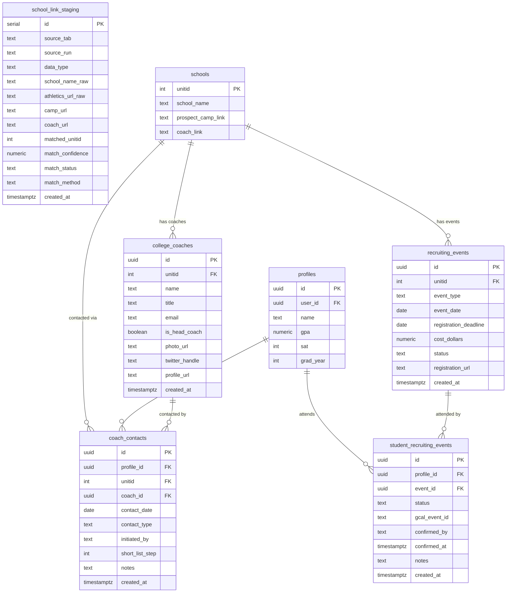
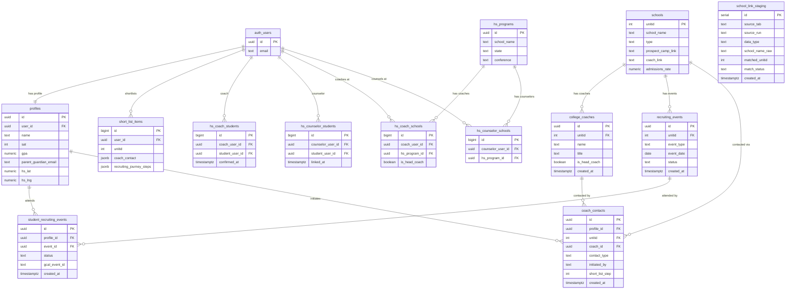

# GrittyOS — After State ERD (Data Enhancement Target)

Generated: 2026-03-31 | Version: Target state post-migrations 0028-0032 | Status: PENDING — David + Patch review required before any migration runs

> **REVIEW REQUIRED — DO NOT EXECUTE**
> 
> This document represents the target database state after data enhancement migrations 0028-0032. David and Patch must confirm fidelity and viability before any npm run migrate is called. Scout holds the run gate.

> **DATA PATHWAY PROHIBITION — DEC-CFBRB-066**
> 
> No Python script, import function, API call, or migration may write coach contact data to short_list_items.coach_contact. The coach_contacts table (migration 0032) is the only valid destination for coach contact data from Python extraction scripts.

> **F-16 OPEN — schools.unitid completeness not guaranteed**
> 
> Known gaps: new NCAA membership programs, joint-institution programs (e.g. Claremont-Mudd-Scripps), name disambiguation failures. Manual unitid resolution required before production inserts into coach_contacts and recruiting_events. school_link_staging review workflow must complete first.

---

## Migration Sequence

| Migration | Table | Type | Depends On |
|-----------|-------|------|-----------|
| 0028 | school_link_staging | STAGING | None — no FK constraints |
| 0029 | college_coaches | NEW ENTITY | schools.unitid (FK) |
| 0030 | recruiting_events | NEW ENTITY | schools.unitid (FK) |
| 0031 | student_recruiting_events | NEW JUNCTION | profiles.id, recruiting_events.id |
| 0032 | coach_contacts | NEW JUNCTION | profiles.id, schools.unitid, college_coaches.id |

## Decisions Governing These Migrations

| Decision ID | Decision |
|-------------|----------|
| DEC-CFBRB-064 | UUID PKs for all four entity/junction tables (college_coaches, recruiting_events, student_recruiting_events, coach_contacts). school_link_staging uses serial PK. |
| DEC-CFBRB-065 | is_head_coach boolean on college_coaches. Data cleanup script deferred post-v1. |
| DEC-CFBRB-066 | coach_contacts is a separate table. JSONB field short_list_items.coach_contact is legacy only. No new writes to JSONB. |
| DEC-CFBRB-067 | CHECK constraints (not Postgres CREATE TYPE) for all enum-like columns. |
| DEC-CFBRB-068 | David owns unitid reconciliation for F-16. Scout authorization required before each cross-reference. |
| DEC-CFBRB-069 | school_link_staging is permanent staging infrastructure, not a one-time artifact. |

## New Table Definitions

### 0028 — school_link_staging (STAGING)

No RLS. Service role access only. No FK on matched_unitid — staging allows unresolved rows. Permanent infrastructure for future link data imports.

| Column | Type | Constraints | Notes |
|--------|------|-------------|-------|
| id | serial | PK | Auto-increment — not uuid, staging table |
| source_tab | text | NOT NULL | D1-FBS \| D1-FCS \| D2 \| D3 |
| source_run | text | NOT NULL | Import run identifier e.g. 2026-03-31 |
| data_type | text | NOT NULL | camp_link \| coach_link \| future types |
| row_index | int | | Row position in source tab |
| school_name_raw | text | | Exact text from Google Sheet |
| athletics_url_raw | text | | Exact URL from Google Sheet |
| camp_url | text | nullable | |
| coach_url | text | nullable | |
| matched_unitid | int | nullable — NO FK | F-16: no FK constraint — staging allows unresolved |
| match_confidence | numeric | nullable | 0.0–1.0 fuzzy match score |
| match_status | text | CHECK constraint | pending \| auto_confirmed \| manually_confirmed \| unresolved |
| match_method | text | nullable | name_fuzzy \| domain \| manual |
| reviewed_by | text | nullable | Who confirmed the match |
| reviewed_at | timestamptz | nullable | |
| created_at | timestamptz | default now() | |

### 0029 — college_coaches (NEW)

Named college_coaches always — never coaches. Distinguishes from hs_coach_students and hs_coach_schools at all times in DB, code, and scripts. RLS: public SELECT, service role writes only.

> **ON DELETE RESTRICT on unitid FK — do not cascade delete coaches if school is removed.**

| Column | Type | Constraints | Notes |
|--------|------|-------------|-------|
| id | uuid | PK — DEC-CFBRB-064 | |
| unitid | int | FK → schools(unitid) ON DELETE RESTRICT | F-16: unitid must exist in schools before insert |
| name | text | NOT NULL | |
| title | text | nullable | |
| email | text | nullable | Incomplete data expected from scrape |
| photo_url | text | nullable | |
| twitter_handle | text | nullable | |
| is_head_coach | boolean | default false | DEC-CFBRB-065. Cleanup script needed post-v1 for staff turnover. |
| profile_url | text | nullable | |
| created_at | timestamptz | default now() | |

### 0030 — recruiting_events (NEW)

RLS: public SELECT, service role writes only. ON DELETE RESTRICT on unitid FK.

| Column | Type | Constraints | Notes |
|--------|------|-------------|-------|
| id | uuid | PK — DEC-CFBRB-064 | |
| unitid | int | FK → schools(unitid) ON DELETE RESTRICT | |
| event_type | text | CHECK constraint — DEC-CFBRB-067 | camp \| junior_day \| official_visit \| unofficial_visit |
| event_name | text | nullable | |
| event_date | date | NOT NULL | |
| registration_deadline | date | nullable | |
| cost_dollars | numeric(8,2) | nullable | Explicit precision per Patch advisory |
| registration_url | text | nullable | |
| status | text | CHECK constraint — DEC-CFBRB-067 | confirmed \| registration_open \| completed \| cancelled |
| created_at | timestamptz | default now() | |

### 0031 — student_recruiting_events (NEW)

RLS: student reads/writes own rows via profiles.user_id. HS coach reads linked students. HS counselor reads linked students.

| Column | Type | Constraints | Notes |
|--------|------|-------------|-------|
| id | uuid | PK — DEC-CFBRB-064 | |
| profile_id | uuid | FK → profiles(id) | Not user_id — indirection through profiles |
| event_id | uuid | FK → recruiting_events(id) | |
| status | text | CHECK constraint — DEC-CFBRB-067 | recommended_by_coach \| registered \| on_calendar \| attended |
| gcal_event_id | text | nullable | Google Calendar sync ID |
| confirmed_by | text | CHECK constraint — DEC-CFBRB-067 | student \| parent \| hs_coach |
| confirmed_at | timestamptz | nullable | |
| notes | text | nullable | |
| created_at | timestamptz | default now() | |

**Constraint:** UNIQUE(profile_id, event_id) — DEC-CFBRB-062

### 0032 — coach_contacts (NEW)

Triple junction: profiles + schools + college_coaches. No direct FK to short_list_items — logically scoped via composite (profile_id + unitid).

> **college_coaches CANNOT write their own contact records. Integrity rule — no exceptions.**

| Column | Type | Constraints | Notes |
|--------|------|-------------|-------|
| id | uuid | PK — DEC-CFBRB-064 | |
| profile_id | uuid | FK → profiles(id) | |
| unitid | int | FK → schools(unitid) | F-16: unitid must exist before insert |
| coach_id | uuid | FK → college_coaches(id) nullable | Null if contact is with program, not specific coach |
| contact_date | date | NOT NULL | |
| contact_type | text | CHECK constraint — DEC-CFBRB-067 | email \| call \| text \| in_person \| dm \| camp |
| initiated_by | text | CHECK constraint — DEC-CFBRB-067 | student \| parent \| hs_coach \| college_coach |
| short_list_step | int | nullable, 1-15 | Maps to recruiting_journey_steps pipeline position |
| notes | text | nullable | |
| created_at | timestamptz | default now() | |

## Open Flags Affecting These Migrations

| Flag | Type | Risk | Action Required |
|------|------|------|-----------------|
| F-16 | DATA-INTEGRITY | High | schools.unitid completeness not guaranteed. Manual resolution workflow via school_link_staging required before production inserts into college_coaches, recruiting_events, or coach_contacts. |
| F-17 | INFRASTRUCTURE | Blocking | school_link_staging (0028) must be created and populated before any other new table receives data. |
| F-09 | MISSING | Blocking | college_coaches — resolved by migration 0029. |
| F-10 | MISSING | Blocking | recruiting_events — resolved by migration 0030. |
| F-11 | MISSING | Blocking | student_recruiting_events — resolved by migration 0031. |
| F-15 | MISSING | Blocking | coach_contacts — resolved by migration 0032. |

## Diagram — New Tables Only

## Diagram — Full Schema

